# Agentic Financial Risk Copilot

An end-to-end quantitative finance and Agentic AI project combining **GARCH**, **LSTM deep learning**, **hybrid volatility forecasting**, **portfolio risk management**, **VaR / Expected Shortfall**, **stress testing**, and a **local LLM agent with deterministic guardrails**.

This project was developed as part of a Master's-level course in **Deep Learning and Agentic AI**.

---

## Project Objective

The objective is to build an intelligent financial risk analysis pipeline capable of:

- forecasting financial market volatility;
- comparing econometric and deep-learning approaches;
- estimating portfolio market risk;
- computing Value-at-Risk and Expected Shortfall;
- backtesting VaR models;
- performing financial stress tests;
- exposing quantitative calculations as callable tools;
- allowing a local LLM to select the appropriate financial tool;
- securing critical financial outputs using deterministic guardrails.

The LLM does **not** calculate financial risk metrics itself.

All quantitative calculations remain implemented in Python.

---

## Financial Data

Five financial series are used:

| Asset | Ticker | Role |
|---|---|---|
| BNP Paribas | `BNP.PA` | Portfolio asset |
| AXA | `CS.PA` | Portfolio asset |
| Société Générale | `GLE.PA` | Portfolio asset |
| CAC 40 | `^FCHI` | Market factor |
| S&P 500 | `^GSPC` | Market factor |

The risk portfolio contains:

- BNP Paribas
- AXA
- Société Générale

with equal weights of **1/3 per asset**.

CAC 40 and S&P 500 are used as market information and are not portfolio holdings.

Data period:

**2015-01-05 to 2026-09-28**

---

## Project Architecture

```text
MARKET DATA
BNP • AXA • Société Générale • CAC40 • S&P500
                    |
                    v
            RETURNS & FEATURES
                    |
          ---------------------
          |                   |
          v                   v
        GARCH                LSTM
          |                   |
          ----------- ---------
                    |
                    v
              HYBRID MODEL
                    |
                    v
          PORTFOLIO RISK ENGINE
          Volatility • VaR • ES
                    |
          ---------------------
          |                   |
          v                   v
     VaR BACKTEST        STRESS TESTS
          |                   |
          ----------- ---------
                    |
                    v
             FINANCIAL TOOLS
                    |
                    v
          LLAMA 3.2 + OLLAMA
                    |
                    v
               GUARDRAILS
                    |
                    v
       FINANCIAL RISK COPILOT
```

---

## GARCH Model

The econometric baseline is:

**AR(1)-GARCH(1,1) with Student-t innovations**

The model is designed to capture:

- volatility clustering;
- volatility persistence;
- heavy-tailed financial returns.

Residual diagnostic tests are also performed after estimation.

---

## LSTM Model

The deep-learning model is implemented with **PyTorch**.

The LSTM uses sequences of **30 trading days**.

For each of the five financial series, the following features are generated:

- return;
- absolute return;
- squared return;
- 5-day rolling volatility;
- 20-day rolling volatility.

This produces:

**5 assets × 5 features = 25 input features**

The network predicts next-day variance for all five assets.

The model contains approximately **58,821 trainable parameters**.

Early stopping is used during training.

Best validation performance was obtained around **epoch 9**, with training stopping at epoch 24.

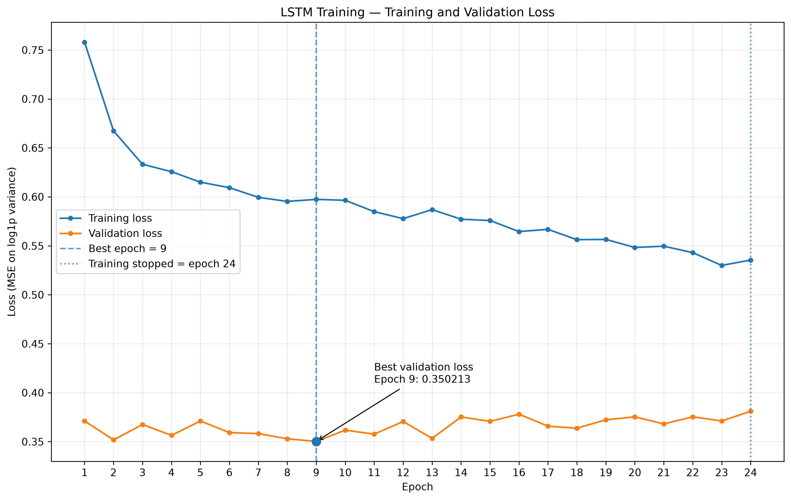

---

## Hybrid GARCH-LSTM Model

GARCH and LSTM forecasts are combined using weights optimized on the validation dataset.

| Asset | GARCH Weight | LSTM Weight |
|---|---:|---:|
| BNP | 64% | 36% |
| AXA | 30% | 70% |
| Société Générale | 74% | 26% |
| CAC 40 | 34% | 66% |
| S&P 500 | 51% | 49% |

The combination is therefore **asset-specific**.

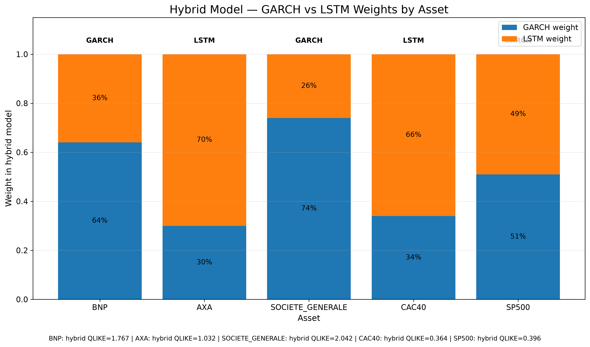

---

## Model Comparison

The volatility models are evaluated using:

- Mean Squared Error (MSE);
- Mean Absolute Error (MAE);
- QLIKE loss;
- correlation between realized and predicted variance.

Main observations:

- **HYBRID** obtains the lowest MSE for all five assets;
- **LSTM** obtains the lowest MAE for all five assets;
- **LSTM** obtains the highest forecast/realized variance correlation for all five assets;
- **GARCH** obtains the best QLIKE for BNP and Société Générale;
- **HYBRID** obtains the best QLIKE for AXA, CAC 40 and S&P 500.

No single model is therefore considered universally superior.

### MSE

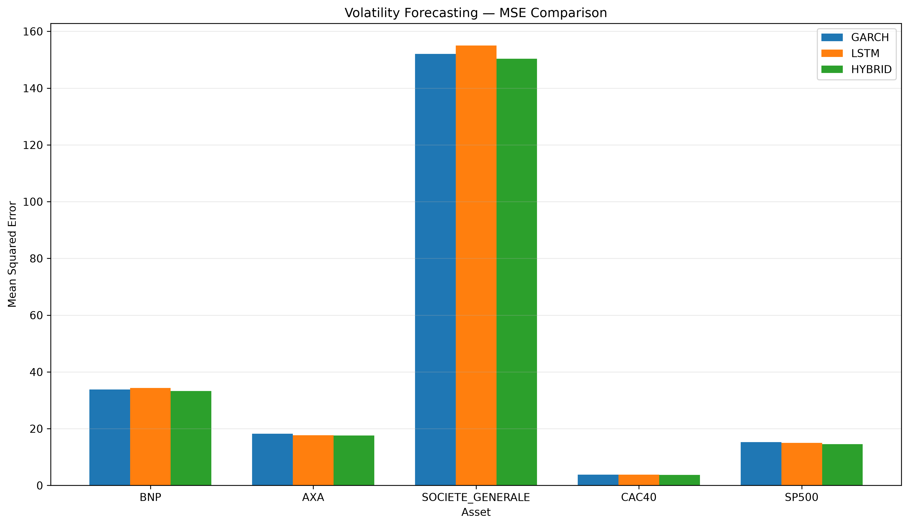

### MAE

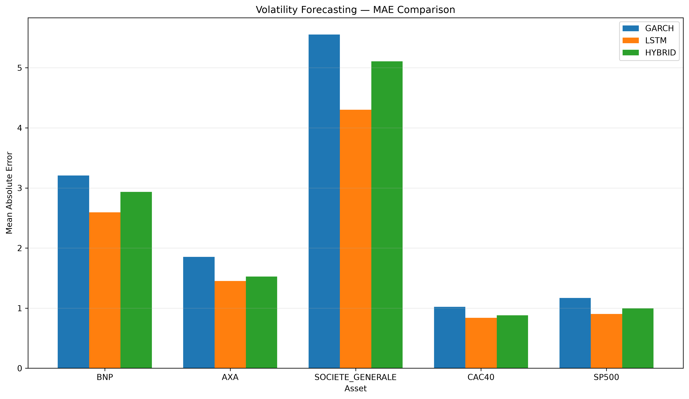

### QLIKE

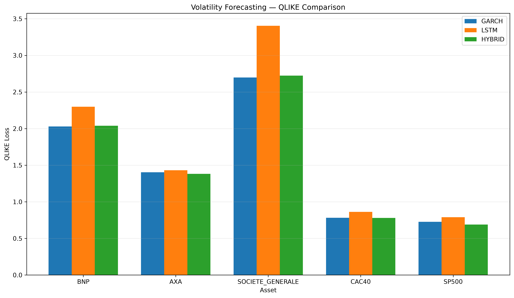

### Correlation

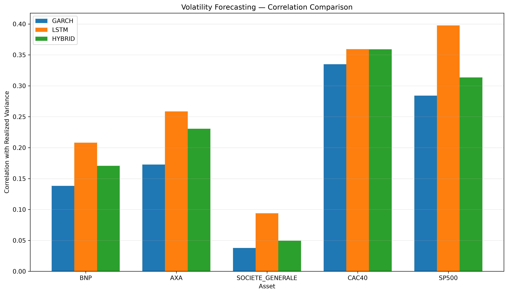

---

## Portfolio Risk Engine

The portfolio is equally weighted:

```text
BNP Paribas          33.33%
AXA                  33.33%
Société Générale     33.33%
```

A rolling **60-day historical correlation matrix** is combined with predicted asset volatilities.

The engine computes:

- daily portfolio volatility;
- annualized volatility;
- VaR 95%;
- VaR 99%;
- Expected Shortfall 95%;
- Expected Shortfall 99%.

### Latest HYBRID estimate

Date: **2026-09-28**

| Risk Measure | Value |
|---|---:|
| Daily volatility | 1.2476% |
| Annualized volatility | 19.8052% |
| VaR 95% | 1.6678% |
| Expected Shortfall 95% | 2.7753% |
| VaR 99% | 3.2515% |
| Expected Shortfall 99% | 5.0746% |

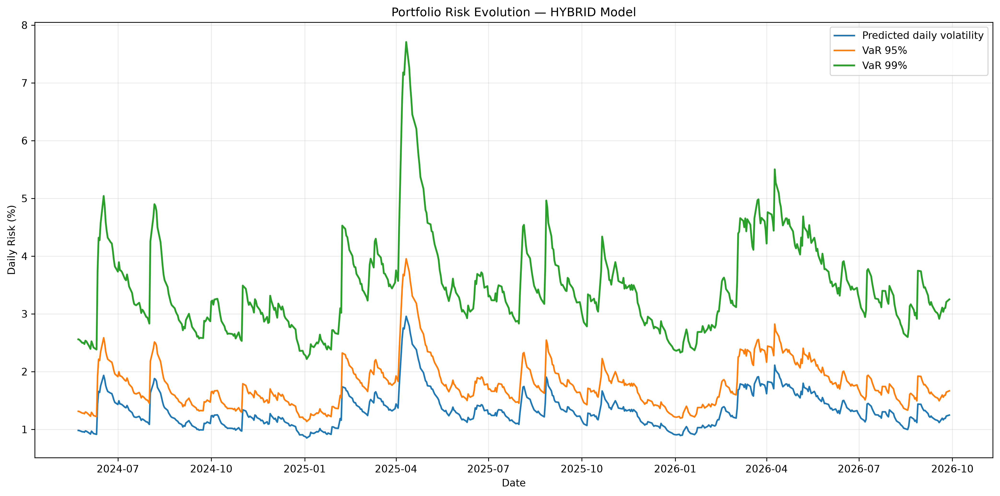

---

## VaR Backtesting

Value-at-Risk coverage is evaluated using the **Kupiec unconditional coverage test**.

The test period contains **607 observations**.

At a 5% significance level:

| Model | Confidence | Result |
|---|---:|---|
| GARCH | 95% | Rejected |
| GARCH | 99% | Not rejected |
| LSTM | 95% | Rejected |
| LSTM | 99% | Rejected |
| HYBRID | 95% | Rejected |
| HYBRID | 99% | Rejected |

For GARCH at 99%:

**Kupiec p-value ≈ 0.071**

A non-rejection does not prove perfect calibration. It only means that the unconditional coverage hypothesis is not rejected at the selected significance level.

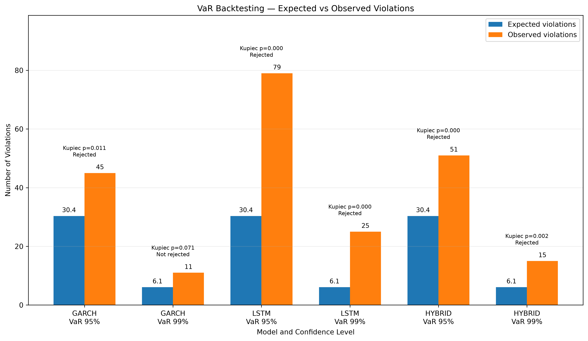

---

## Stress Testing

Four deterministic scenarios are implemented.

| Scenario | BNP | AXA | Société Générale | Portfolio Loss |
|---|---:|---:|---:|---:|
| Market Correction | -6% | -5% | -8% | -6.33% |
| Rate Shock | -7% | -9% | -8% | -8.00% |
| Banking Stress | -12% | -6% | -15% | -11.00% |
| Severe Crash | -18% | -15% | -22% | -18.33% |

These scenarios are **hypothetical stress scenarios and not market forecasts**.

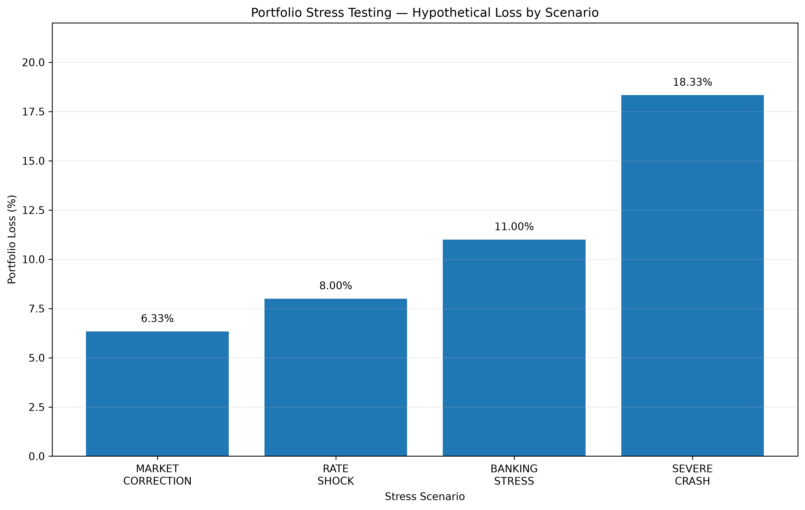

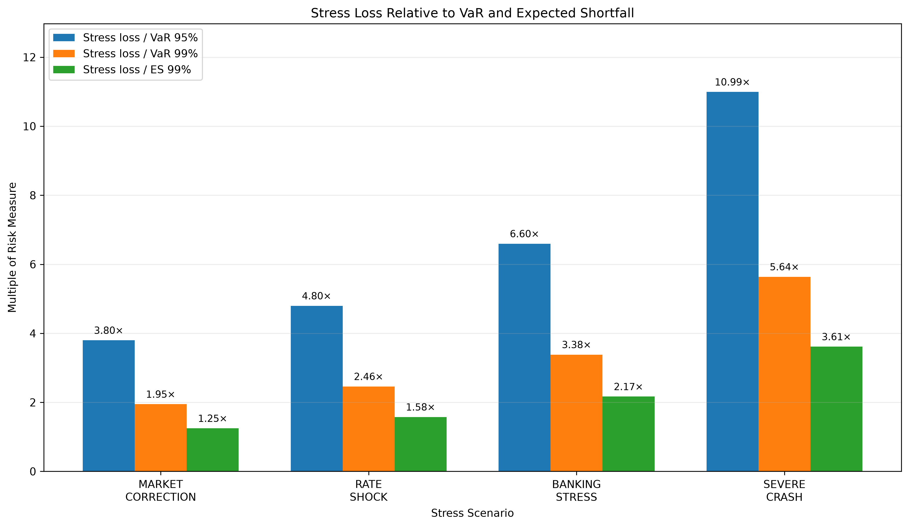

---

## Agentic AI

A local LLM is integrated into the project using:

**Llama 3.2 3B + Ollama**

The agent has access to four financial tools:

```python
get_current_risk()

compare_volatility_models()

get_var_backtest()

run_stress_analysis()
```

The LLM is responsible for understanding the user's question and selecting the appropriate tool.

The Python risk engine remains responsible for the numerical calculations.

This separation reduces the risk of financial numerical hallucinations.

---

## Guardrails

The Agentic AI system includes deterministic guardrails.

### Argument Guardrail

Tool arguments are checked and normalized before execution.

### Orchestration Guardrail

For single-intent questions, unnecessary additional tool calls can be removed.

### Output Guardrail

Critical financial numbers are formatted directly from Python results rather than allowing the LLM to freely regenerate them.

---

## Agent Evaluation

The agent was evaluated using a closed benchmark containing **40 questions**.

The benchmark covers:

- current portfolio risk;
- volatility model comparison;
- VaR backtesting;
- stress testing.

Results with `llama3.2:3b`:

| Metric | Raw LLM | With Guardrails |
|---|---:|---:|
| Top-1 tool routing | 100% | 100% |
| Single-tool execution | 97.5% | 100% |
| Argument validity | 97.5% | 100% |
| Strict call success | 95% | 100% |
| Final execution success | — | 100% |

Mean routing latency:

**0.54 seconds**

95th percentile latency:

**0.69 seconds**

These results apply to the closed 40-question benchmark and should not be interpreted as universal LLM performance.

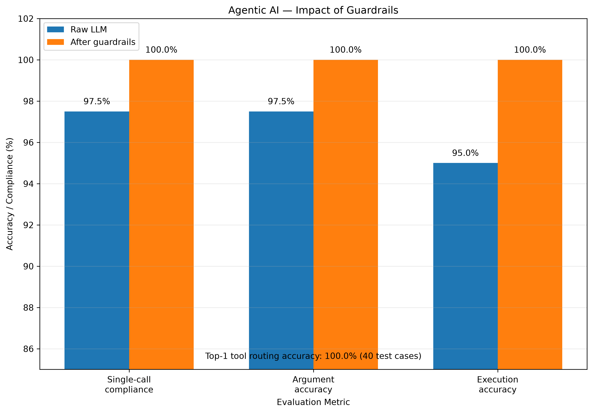

---

## Repository Structure

This section simply shows how the project files are organized.

```text
agentic-financial-risk-copilot/
│
├── data/
│   └── processed/
│       ├── market_prices.csv
│       ├── market_returns.csv
│       └── lstm_dataset.npz
│
├── notebooks/
│   └── 01_data_exploration.ipynb
│
├── results/
│   ├── agent_evaluation/
│   ├── comparison/
│   ├── figures/
│   ├── garch/
│   ├── hybrid/
│   ├── lstm/
│   ├── risk/
│   └── stress/
│
├── src/
│   ├── agents/
│   ├── data/
│   ├── evaluation/
│   ├── models/
│   └── risk/
│
├── tests/
│   └── agent_evaluation_cases.json
│
├── .gitignore
├── requirements.txt
└── README.md
```

So, for example:

`src/models/` contains the machine-learning models.

`src/risk/` contains the risk-management calculations.

`src/agents/` contains the Agentic AI system.

`results/figures/` contains the figures displayed in this README.

---

## Installation

Clone the repository:

```bash
git clone https://github.com/ziguieva/agentic-financial-risk-copilot.git
```

Enter the project:

```bash
cd agentic-financial-risk-copilot
```

Create a virtual environment:

```bash
python3 -m venv .venv
```

Activate it on macOS/Linux:

```bash
source .venv/bin/activate
```

Install dependencies:

```bash
pip install -r requirements.txt
```

---

## Ollama

Install Ollama separately, then download the local LLM:

```bash
ollama pull llama3.2:3b
```

Check that the model is installed:

```bash
ollama list
```

The final agent therefore does not require a paid external LLM API.

---

## Main Technologies

- Python
- PyTorch
- NumPy
- Pandas
- Scikit-learn
- Statsmodels
- ARCH
- Matplotlib
- Yahoo Finance
- Ollama
- Llama 3.2 3B

---

## Limitations

The project is an academic prototype.

Current limitations include:

- only three assets in the risk portfolio;
- equal portfolio weights;
- predefined stress scenarios;
- several VaR configurations failing the Kupiec coverage test;
- limited agent evaluation dataset;
- no transaction-cost modelling;
- no liquidity-risk modelling;
- no portfolio optimization;
- dependence on historical data and model assumptions.

These limitations are deliberately reported rather than hidden.

---

## Disclaimer

This project is intended for **academic and research purposes only**.

It does not constitute investment advice or a recommendation to buy or sell financial instruments.

---

